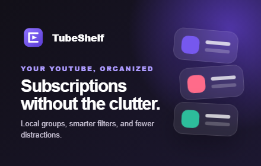
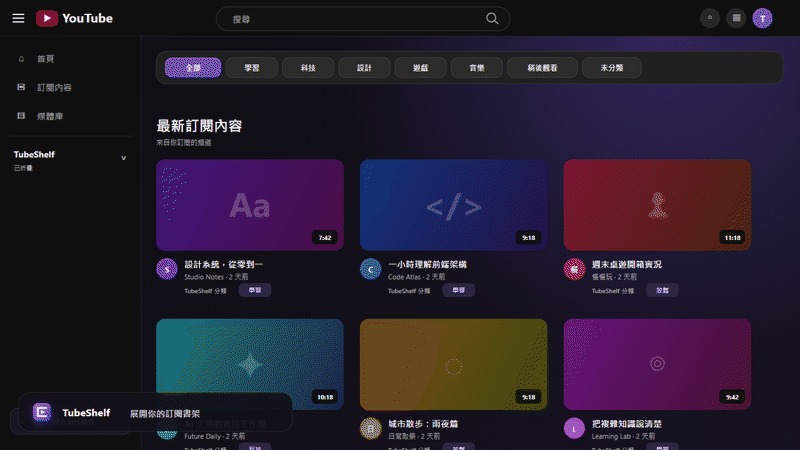
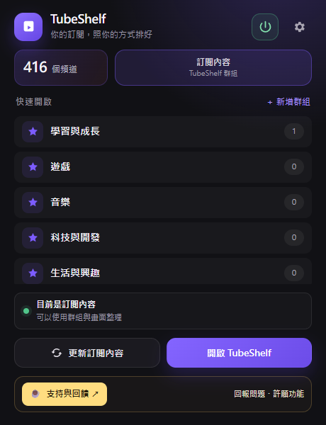
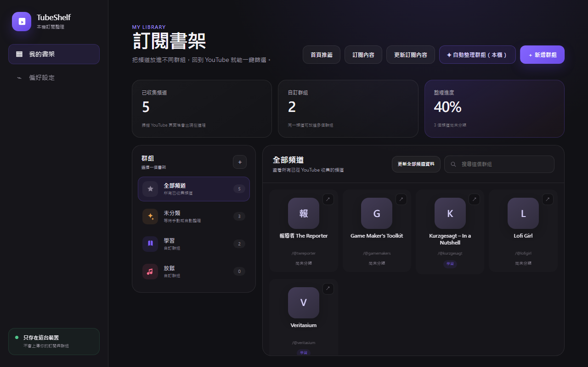
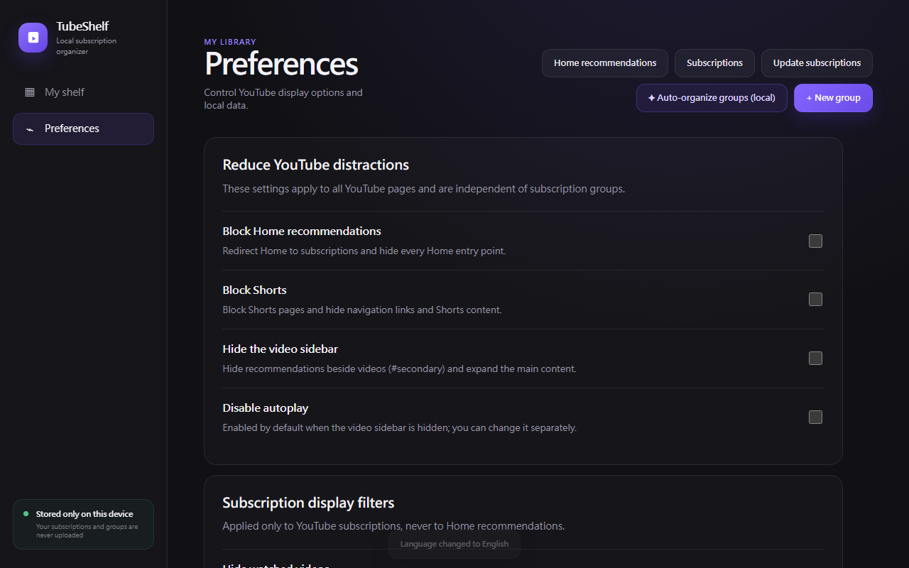

# TubeShelf

<p align="center">
  
</p>

<p align="center">
  <strong>Your YouTube subscriptions, organized your way.</strong><br>
  A local-first Chrome / Edge extension for organizing subscriptions, reducing distractions, and getting explainable auto-grouping suggestions.
</p>

<p align="center">
  No account · No server · No telemetry · No cloud AI
</p>

> 繁體中文簡介：TubeShelf 是一個把 YouTube 訂閱變成「自己的書架」的 Chrome / Edge 擴充套件。你可以建立群組、直接在 YouTube 裡分類頻道、隱藏干擾內容，並使用完全在本機運作的自動整理建議。

## Quick preview

<p align="center">
  
</p>

## Download & install

**[Install TubeShelf from the Chrome Web Store](https://chromewebstore.google.com/detail/agnnbehkdkdkflknblhkmgciaekngole?utm_source=item-share-cb)**

**Manual package: [Download TubeShelf 1.18.7](https://github.com/TANANIS/TubeShelf/raw/refs/tags/v1.18.7/outputs/TubeShelf-1.18.7.zip)**

### What's new in 1.18.7

- Faster subscription filtering through a per-revision membership index, with bounded update scheduling and fewer redundant page scans.
- A wider popup with more room for groups and a compact support footer.
- A single power button to pause or resume TubeShelf on YouTube. Groups and preferences are preserved, and the saved power state survives reloads.
- Support and feedback links in the popup, dashboard and YouTube panel. The subscription toolbar stays focused on filtering.

The local automated checks pass: 46 unit/static/background tests plus UI, performance and power-toggle browser harnesses. Signed-in YouTube verification remains pending. See [performance findings](PERFORMANCE.md) for the synthetic benchmark and its limits.



Package SHA-256: `b012f4612c4dfbb29efb0acb1f21920c5ee77ae3c82fabd69df2bfc1d3e9a08e`.

> **1.19.0 is in testing.** The Favorites view, dashboard editing, improved classification, and onboarding starter groups are built and pass automated checks, but are not yet offered as the stable download.

### Chrome

Install the extension directly from the [Chrome Web Store](https://chromewebstore.google.com/detail/agnnbehkdkdkflknblhkmgciaekngole?utm_source=item-share-cb).

For manual installation:

1. Download `TubeShelf-1.18.7.zip` from the release link above.
2. Extract the ZIP file.
3. Open `chrome://extensions/`.
4. Enable **Developer mode**.
5. Select **Load unpacked**.
6. Choose the extracted folder that contains `manifest.json`.
7. Reload any YouTube tabs that were already open.

### Edge

Use the same steps from `edge://extensions/`.

Developers can also clone this repository and load the `extension` directory directly.

## Why TubeShelf?

YouTube recommendations and YouTube subscriptions serve different purposes.

TubeShelf keeps those two experiences separate: your Home page can remain driven by YouTube's recommendation algorithm, while your Subscriptions page becomes a space you organize yourself.

Instead of replacing YouTube, TubeShelf adds a lightweight organization layer directly into it.

## What you can do

### Organize subscriptions your way

- Create custom groups with your own names, colors, and icons.
- Put the same channel in multiple groups.
- Switch groups directly from YouTube's sidebar or Subscriptions page; the sidebar group list starts collapsed to save space.
- See each stored channel's group directly beneath its video preview metadata in the Subscriptions feed.
- Classify a channel beside the Subscribe button on channel and watch pages.
- Pause or resume TubeShelf's YouTube integration with the popup power button; your groups and preferences stay saved.
- Newly subscribed channels can enter **Unclassified** automatically; unsubscribed channels are removed from TubeShelf automatically.
- TubeShelf's YouTube-integrated controls follow YouTube's light and dark themes.

### Reduce recommendation-driven distractions

TubeShelf lets you independently choose whether to:

- block the YouTube Home page and redirect to Subscriptions;
- hide Shorts and its navigation entry;
- hide the recommendation sidebar on watch pages;
- disable autoplay;
- hide already-watched videos from your subscription feed.

These controls are separate from subscription groups, so you can keep as much or as little of the original YouTube experience as you want.

### Auto-organize locally

TubeShelf can suggest groups for unclassified channels without sending your subscription library to a cloud AI service.

Suggestions can use:

- channel names and public descriptions;
- channel keywords;
- recurring topics from recent video titles;
- a built-in multilingual topic dictionary;
- optional public YouTube topic/category metadata;
- vocabulary learned from your own manual corrections.

Low-confidence or conflicting results stay unclassified. Suggestions are shown before anything changes, and existing manual groups are never overwritten automatically.

### Private by default

TubeShelf stores your groups, channels, preferences, and learned classifications in `chrome.storage.local`.

There is:

- no TubeShelf account;
- no TubeShelf server;
- no telemetry or analytics;
- no advertising profile;
- no cloud AI classification.

If you optionally add your own YouTube Data API key, TubeShelf sends public channel/video IDs directly to Google's YouTube Data API to retrieve public metadata. The key stays on your device and is excluded from JSON backups.

See [PRIVACY.md](PRIVACY.md) for the full privacy policy.

## Screenshots

### Subscription shelf



### Preferences



## Getting started

1. Open [YouTube's subscribed channels page](https://www.youtube.com/feed/channels).
2. Open TubeShelf from the browser toolbar and choose **Update subscriptions**.
3. TubeShelf will load your subscribed channels and save the collected public channel information locally.
4. Open **Manage groups**.
5. Create groups manually, or run **Auto-organize groups (local)** for suggestions.
6. Review the suggestions and apply only the groups you want.
7. Return to YouTube and switch shelves directly from the YouTube interface.

You can also classify the channel you are currently watching from the **Groups** control beside its Subscribe button.

## How local classification works

TubeShelf's classifier is deliberately conservative.

It scores signals such as channel descriptions, keywords, recent video titles, known topic phrases, exclusions, official YouTube categories, and vocabulary learned from manual group assignments.

The highest-scoring result must also be sufficiently stronger than alternatives. Ambiguous results remain unclassified instead of being forced into a group.

The UI shows classification confidence and the signals behind a suggestion so that the result can be inspected before being applied.

## Optional: YouTube Data API

TubeShelf works without an API key.

If you want additional public classification signals, you can enable **YouTube Data API v3** in your own Google Cloud project and paste your API key into TubeShelf Preferences.

When enabled, TubeShelf can use public YouTube channel topics, video categories, and related metadata alongside the local classifier.

Your API key:

- is stored locally;
- is not included in TubeShelf JSON exports;
- is sent only to Google's YouTube Data API when that feature is used.

## Backup and transfer

TubeShelf can export and import your local library as JSON.

Exports include your groups and channel URLs. Sensitive values such as your YouTube Data API key are not included.

You can also clear TubeShelf's local data without changing your actual YouTube subscriptions.

## Languages

TubeShelf currently supports:

- English
- 繁體中文

The default interface is English unless a Traditional Chinese browser locale is detected. Changing the UI language does not rename your channels or custom groups.

## Technical notes

- Chrome Extension Manifest V3
- Vanilla JavaScript, HTML, and CSS
- Local state stored with `chrome.storage.local`
- Incremental YouTube DOM observation instead of repeatedly rescanning the entire page
- Background tabs pause DOM observation to reduce unnecessary work
- Supports multiple generations of YouTube video/channel renderers
- JSON backup and restore
- Node.js unit tests plus Playwright UI smoke tests

## Development and verification

Core checks can be run with Node.js:

```powershell
node --test tests/shared.test.js
node --check extension/shared.js
node --check extension/content/content.js
node --check extension/popup/popup.js
node --check extension/dashboard/dashboard.js
```

The repository also includes UI smoke tests for the dashboard, onboarding flow, popup, group management, localization, and YouTube-integrated controls.

## Current limitations

YouTube is a continuously changing single-page application. TubeShelf depends on public page structure and public metadata, so future YouTube UI changes may occasionally require selector or parser updates.

Subscription discovery may automatically scroll YouTube's subscribed-channels page until the list stabilizes. Classification quality also depends on the public metadata available for each channel; uncertain results intentionally remain unclassified.

## Project principles

TubeShelf currently focuses on three principles:

1. **User control over recommendation-driven behavior.**
2. **Local-first organization and privacy.**
3. **Automation that stays inspectable and reversible.**

## License

TubeShelf is released under the [MIT License](LICENSE).

## Disclaimer

TubeShelf is an independent project and is not affiliated with, endorsed by, or sponsored by YouTube, Google, or PocketTube.

The original feature concept was inspired by subscription-management tools such as PocketTube, while TubeShelf's implementation, interface, local classifier, and product direction are independently developed.
